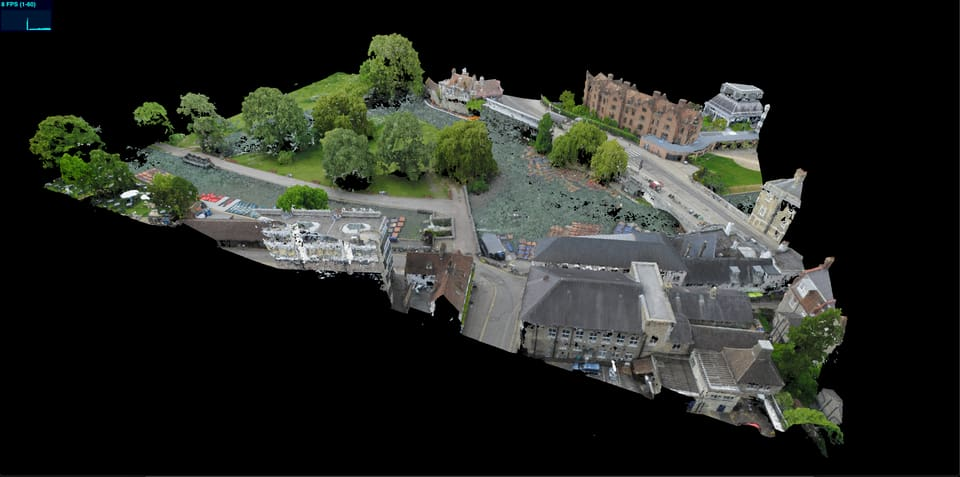

# WebGL Code Exercise

## Task

DISCLAIMER: This task was written with WebGL in mind (the graphics api used at sensat).
It can be completed using any graphics framework/api that you are comfortable working with.

Given some GLTF pointclouds, display the data in webgl and allow the user to select a point on the point cloud.
The data can be found in `assets/`

- `big_cloud.glb` test data to display
- `small_cloud.glb` small amount of data, useful for rapid testing.

### Goals

1. Display point data on screen
2. Implement point selection (console logging the points location is sufficient)
3. Produce a document explaining design choices, approach & build/run instructions.

### Bonus Goals (If you feel like it)

- Optomise app performance.
- Change colour of selected point.
- Build tool to measure distance between 2 points.
- Unit tests

### Tips & Tricks

- Feel free to use the existing code in this repo as a starting point, writing your own app from scratch is also accepted.
- You can change the code in the existing project as you see fit.
- You can use whatever libraries you see fit.
- You can alter the data, as long as the end visualisation looks the same.
- Document everything! This is the easiest way for you to supply us with context for the submission. - What decisions/compromises where made? - What you would improve/change? - What you learned? - Anything else!

## Using the existing code

Starter code for exercise, using typescript & Threejs

### Install

To install dependencies run:

    $ yarn

### Development

    $ yarn start

Serves the development build on `http://localhost:8080`, which will rebuild on file changes.

### Design choices
Raycaster over GPU picking - While GPU picking has notable overhead, as the amount of data grows it becomes more efficient. In this example, the models being loaded are sufficiently small that raycasting over that many points is acceptable. 
React - just a very simple way to get a quick UI working to allow me to implement the changing of selected colours
Improve app performance - We don't need to re-render if the camera hasn't changed so we conditionally call render when we know something has changed to avoid wasting idle resources.

### Potential improvements
GPU Picking - by chunking the points in an octree and using the GPU picked colour to determine which chunk to select as a lookup rather than needing to search several areas of the octree that a ray passes through until an intersection is found. However, writing custom shaders to do this seemed a little out of scope for this project given the requested time to be spent.
Chunked asset loading using the same octree method as before
    - also allows for LOD implementation by using lower density point clouds in octree nodes that are further from the camera.
    - both of these would result in performance boosts both in rendering and network costs
    - again splitting the data in such a way to do this seemed out of scope given the requested time. (see below)

### Some learning
Due to the way our data visualisation is done at my current company, we have to generate our meshes on the fly in the browser rather than using an existing 3d model format like glTF. This part was new to me, but does not seem particularly complex - I couldn't see any obvious place where geotagging info might have been stored (or it has just been removed from the supplied files) hence my decision to just utilise the model bounding box upon loading. Given this I also felt it best to focus on other areas rather than trying to split the assets as I wasn't sure if there may be any hidden pitfalls with that approach. It seemed a better use of the time to focus on showcasing the other areas I have previous experience in.